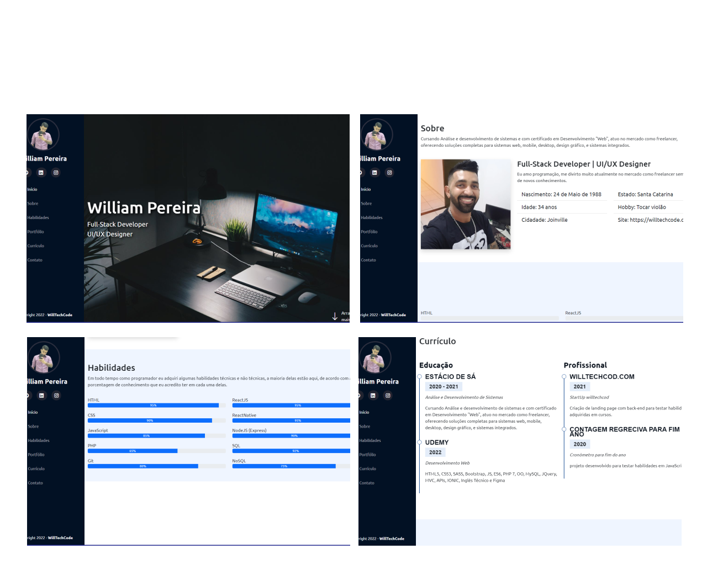

##Meu portfólio feio com HTML5, CSS3 e JavaScript

# Indice

- [Sobre](#-sobre)
- [Tecnologias](#Tecnologias)
- [Como acessar o projeto](#-como-acessar-o-projeto)

## 🔖&nbsp; Sobre

Meu currículo pessoal de apresentação

---

## Tecnologias

Esse projeto foi desenvolvido com as seguintes tecnologias:

- [HTML](https://#)
- [CSS](https://#/)
- [JavaScript](https://#/)

## Como acessar o projeto

[Clique aqui](https://willtechcod.com)

---

<h3 align="center" >Vamos nos conectar 😉</h3>

  &ensp;
  &ensp;
  

 

    Desenvolvido 💜 por William Pereira Da Conceição

